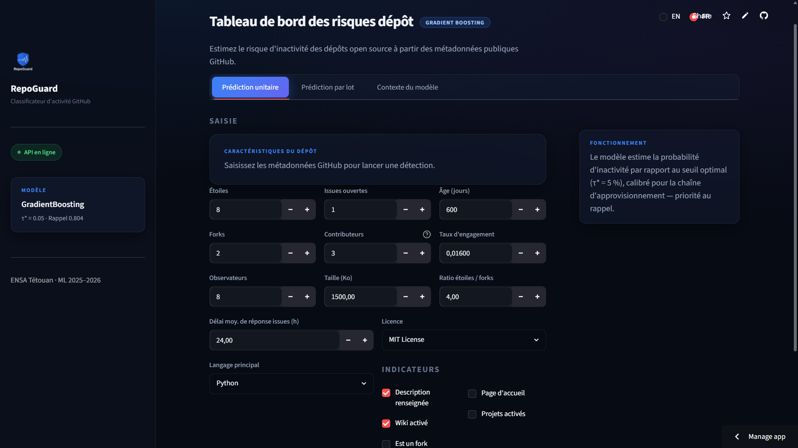
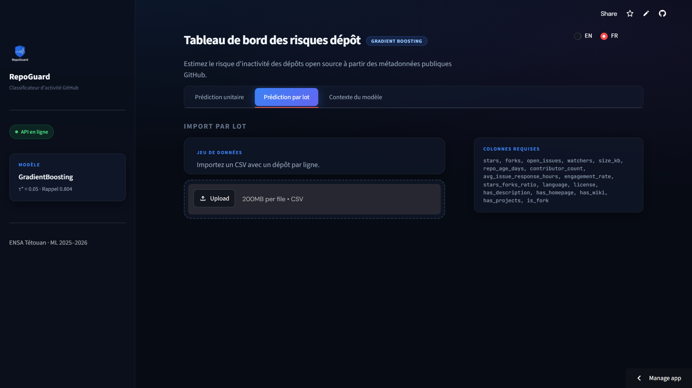
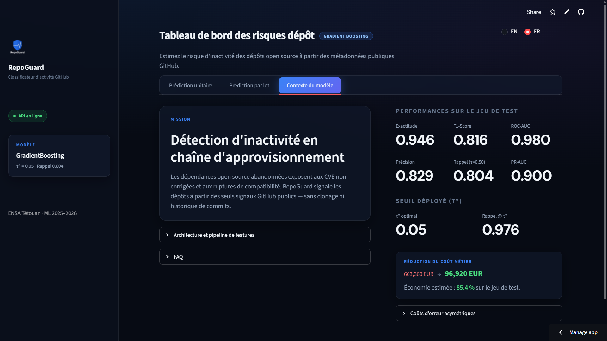

# 🐙 GitHub Repository Activity Classifier

**ENSA Tétouan | Projet de Fin de Module Machine Learning 2025-2026**  
*Enseigné par Pr. Y. EL YOUNOUSSI*  
*Auteurs : Ismail LYAMANI, Abdellatif OUMHELLA, Mohammed Aymane SABER*

---

## 📌 Présentation du Projet

Ce projet implémente un classifieur de réseaux supervisés binaires pour prédire si un dépôt GitHub (utilisé comme dépendance dans un projet informatique) va devenir **inactif ou abandonné** (aucune modification/push dans les 180 derniers jours) à partir de ses caractéristiques publiques. Cette solution permet aux équipes de sécurité et de gestion de dépendances logicielles (ex: Dependabot, Snyk) de détecter proactivement les librairies abandonnées qui présentent des risques de sécurité (failles de dépendance non corrigées).

### Architecture Globale
```
github-repo-activity-classifier/
├── app/
│   ├── api.py                 # API REST FastAPI (Endpoints et Preprocessing)
│   └── ui.py                  # Interface Utilisateur Streamlit (Formulaire et Mode Batch)
├── data/
│   ├── processed/             # Splits de données (train.csv, validation.csv, test.csv)
│   └── dataset.csv            # Dataset complet (~15 000 lignes)
├── docs/
│   ├── screenshots/           # Captures d'écran de l'interface Streamlit
│   │   ├── tab1_single.png
│   │   ├── tab2_batch.png
│   │   └── tab3_info.png
│   ├── ensate_logo.png        # Logo ENSA Tétouan
│   └── main.tex               # Rapport LaTeX du projet
├── models/
│   ├── final_model.joblib     # Pipeline complet (preprocessor + GradientBoosting)
│   └── final_model_metadata.json # Seuil critique (0.05) et métriques de performance
├── notebooks/
│   ├── 01_discovery.ipynb     # Phase 1: EDA Initiale
│   ├── 02_eda.ipynb           # Phase 2: EDA Avancée
│   ├── 03_preprocessing.ipynb # Phase 2: Nettoyage et Pipeline
│   ├── 04_modeling.ipynb      # Phase 3: Modélisation et CV
│   ├── 05_tuning.ipynb        # Phase 3: GridSearch/RandomSearch
│   └── 06_evaluation.ipynb    # Phase 3: Évaluation et Seuil Optimal
├── src/
│   └── data_collection.py     # Script de collecte via l'API GitHub
├── tests/
│   └── test_api.py            # Tests unitaires Pytest pour l'API REST
├── .dockerignore
├── docker-compose.yml         # Orchestration multi-conteneur (API et UI)
├── .env.example               # Exemple de variables d'environnement (GITHUB_TOKEN, etc.)
├── Dockerfile                 # Conteneurisation de l'API et de l'UI (python:3.11-slim)
├── requirements.txt           # Dépendances figées du projet
└── README.md
```

---

## 🖥️ Interface Utilisateur Streamlit

L'interface utilisateur comporte trois sections principales permettant d'interagir facilement avec le modèle :
1. **Prédiction Unitaire** : Saisie manuelle de toutes les caractéristiques pour classifier un dépôt.
2. **Prédiction par Lot** : Dépôt d'un fichier CSV pour obtenir instantanément des prédictions en masse avec visualisation statistique.
3. **Informations Modèle & Contexte Métier** : Explication de la matrice de coûts asymétriques et du seuil optimal décisionnel de 0.05.

### Captures d'Écran de l'Interface

#### 🔍 Formulaire de Prédiction Unitaire


#### 📁 Résumé Statistique du Traitement par Lot


### 📊 Informations sur le Modèle


---

## 🚀 Guide de Démarrage Rapide

### 🐳 Option A : Démarrage avec Docker (Recommandé)

Docker Compose orchestre automatiquement le conteneur API FastAPI (port 8000) et le conteneur UI Streamlit (port 8500) sur le même réseau virtuel.

1. Installez Docker et Docker Compose.
2. Copiez le fichier d'exemple et configurez vos variables (notamment `GITHUB_TOKEN`) :
   ```bash
   cp .env.example .env
   ```
3. Exécutez la commande suivante à la racine du projet :
   ```bash
   docker compose up --build
   ```
4. Accédez aux services :
   - **Interface Utilisateur (Streamlit) :** [http://localhost:8500](http://localhost:8500)
   - **API REST (Documentation Swagger) :** [http://localhost:8000/docs](http://localhost:8000/docs)
   - **Vérification de l'état (Healthcheck) :** [http://localhost:8000/health](http://localhost:8000/health)

---

### 💻 Option B : Démarrage en Local (Sans Docker)

1. Créez un environnement virtuel et installez les dépendances :
   ```bash
   python -m venv venv
   source venv/Scripts/activate  # Sur Windows: venv\Scripts\activate
   pip install -r requirements.txt
   ```
2. Configurez vos variables d'environnement :
   ```bash
   cp .env.example .env
   ```
3. **Démarrer l'API REST :**
   ```bash
   uvicorn app.api:app --host 127.0.0.1 --port 8000 --reload
   ```
4. **Démarrer l'Interface Utilisateur :**
   ```bash
   streamlit run app/ui.py --server.port 8500 --server.address 127.0.0.1
   ```

---

## 🧪 Exécution des Tests Unitaires

Les tests unitaires vérifient la robustesse des schémas Pydantic, la logique de Feature Engineering et le calcul des probabilités de l'API.

```bash
python -m pytest tests/
```

---

## 📖 Endpoints REST & Exemples d'Utilisation

### Endpoints Disponibles
- `GET /` : Accueil avec métadonnées de l'API.
- `GET /health` : Vérification du statut du modèle.
- `GET /model/info` : Informations sur le Gradient Boosting et les métriques de la phase 3.
- `POST /predict` : Reçoit les caractéristiques brutes et renvoie la classification.
- `POST /predict/batch` : Reçoit un fichier CSV et renvoie le même fichier enrichi des prédictions.

### Exemple de Requête unitaire (Curl)

```bash
curl -X POST http://localhost:8000/predict \
     -H "Content-Type: application/json" \
     -d '{
       "stars": 12,
       "forks": 4,
       "open_issues": 1,
       "watchers": 12,
       "size_kb": 1500.0,
       "repo_age_days": 800,
       "contributor_count": 5,
       "avg_issue_response_hours": 24.0,
       "engagement_rate": 0.02,
       "stars_forks_ratio": 3.0,
       "language": "Python",
       "license": "MIT License",
       "has_description": true,
       "has_homepage": false,
       "has_wiki": true,
       "has_projects": true,
       "is_fork": false
     }'
```

#### Réponse de l'API
```json
{
  "prediction": "inactif",
  "probability": 0.1624,
  "threshold": 0.05,
  "confidence": "medium"
}
```

---

## ⚠️ Limites du Modèle

1. **Sensibilité au bruit** : Le nombre de contributeurs est plafonné à 100 en raison des limites de l'API de recherche GitHub.
2. **Estimation des délais de réponse** : Le délai de réponse aux issues est calculé sur un historique restreint de 20 issues fermées, ce qui peut masquer les évolutions récentes.
3. **Taux de faux positifs élevé** : Avec un seuil de **0.05** (choisi pour maximiser la détection des failles de sécurité, coût de 10 000 € d'un Faux Négatif), environ la moitié des alertes s'avèrent être des projets actifs. Ce choix métier favorise la prudence.

---

## 📜 Licence
Ce projet est sous licence **MIT License**. Pour plus de détails, voir le code source.
